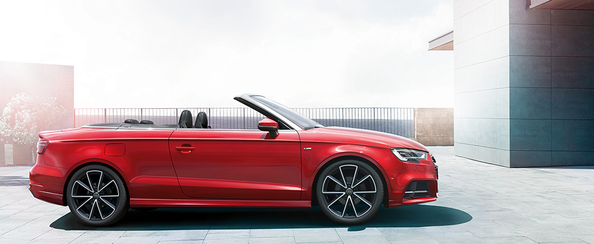
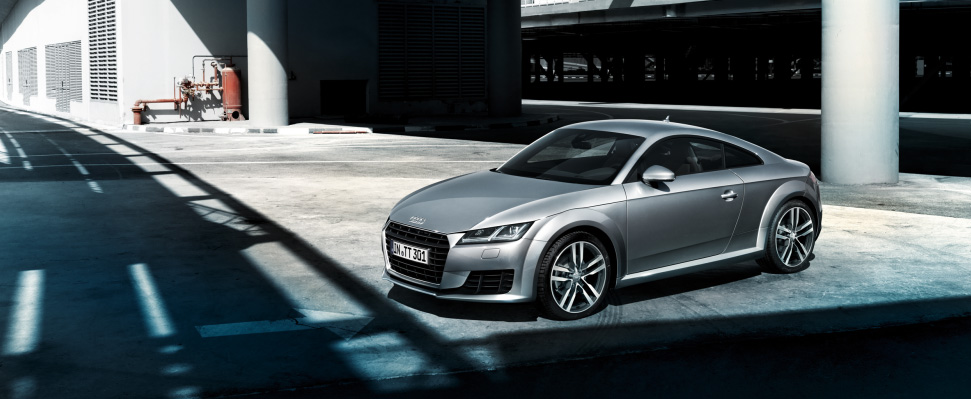
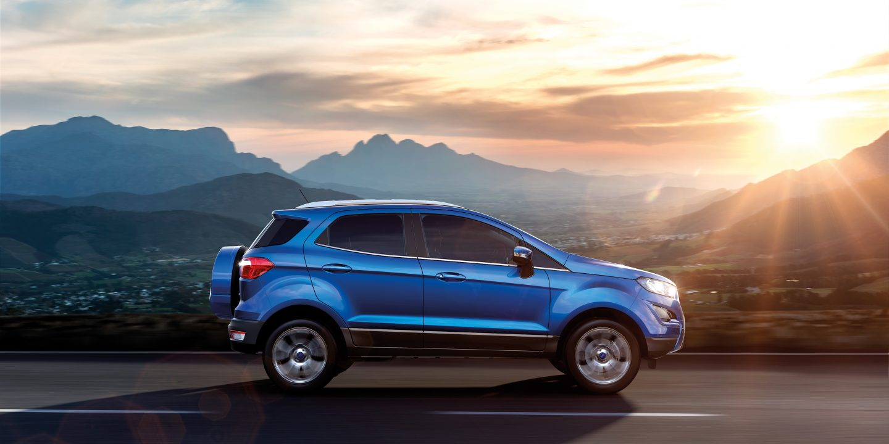
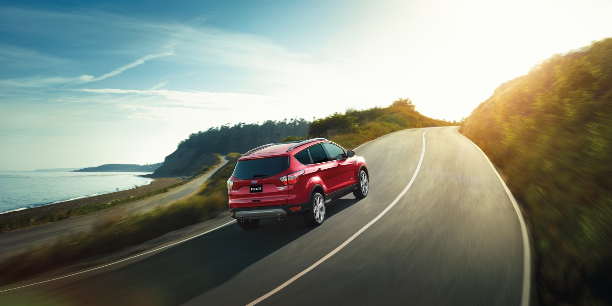
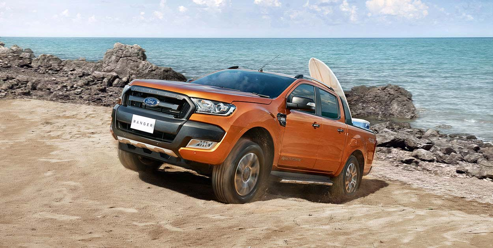

<!-- Headings-->

# Chromatix Cars

<!--Italics -->

**Categories with id number 1; 289; 505; 721**
* 1 stands for Adventure
* 289 stands for Safety
* 505 stands for Performance
* 721 stands for Reliability

**Sub-categories under Adventure**
* Adventure ( 1 )
    * 2  stands for Camping
    * 8  stands for Off Roading
    * 14 stands for Adrenalin
    * 20 stands for Boating

   ```   
    Adventure  ( 1 )

     1 diving
     2 mountain biking
     3 kayaking
     4 surfing
     5 off roading 
     6 camping
     ```

**Sub-categories under Safety**
* Safety    ( 289 )
    * 290 stands for Precious Cargo
    * 296 stands for My First Car
    * 302 stands for A little Prestige

    ```
    Safety( 2 )

     1 room to grow
     2 a little prestige
     ```

**Sub-categories under Performance**
* Performance   ( 505 )
    * 506 stands for Workhorse
    * 512 stands for Excitement
    * 518 stands for Long road trips

    ```
    Performance( 3 )

     1 the weekend
     2 long road trips
     ```
 
**Sub-categories under Reliability**  
*  Reliability  ( 721 )
    * 722 stands for A Workhorse
    * 728 stands for My First Car
    * 734 stands for Prestige

    ```
    Reliability( 4 )

     1 a workhorse
     2 my first car
     3 extra comfort
     ```

*Array of status divided into 4 categories*
 * 3 stands for Single
* 27 stands for Couple
* 51 stands for Family
* 75 stands for Friends

*Regions*
* 4 stands for South
* 100 stands for North
* 196 stands for North-West

```

    1 stands for Southern
    2 stands for Northern
    3 stands for North-West
    4 stands for East Coast
    5 stands for Statewide

```

## Cars
```
    1 Audi A1 id:1
    2 Audi A3 id:2
    3 Audi A3 Cabriolet id:3
    '
    '
    '
    22 Audi TT id:22
```

|   | id        | Name of Car           | Pictures  |
|---| ------------- |:-------------:| -----:|
|   | 1         | Audi               |  |
|   | 3         | Audi Cabriolet            |    |
|   | 22          | Audi TT    |     |


    23 Ford EcoSport id:23
    24 Ford Escape id:24
    '
    '
    '
    33 Ford Ranger id:34


|   | id        | Name of Car           | Pictures  |
|---| ------------- |:-------------:| -----:|
|   | 1         | Ford EcoSport               |  |
|   | 24       | Ford Escape            |    |
|   | 33          | Ford Ranger    |     |

    
 
 
 #  Explaining Data

 ```
 The data below is fetched from REST API in a json format.
  
 "219651": {
      "cars": [
        25,
        33,
        48,
        55,
        45,
        67,
        59,
        63,
        24
      ]

  
 ```
 ```
2 Camping   196 North-West  51 Family 


From the above data for 219651. The number is stored as a data in json format using REST. After the user select the certain category for the personal use of a car. For eg:-
A user wants a car for Camping. He/she wants the car available in North-West Region and he/she needs the car for his/herr Family then the following options of the car is displayed. 

List of car displayed :

25 Ford Everet
33 Ford Ranger
48 Mitsubishi ASX
55 Mitsubishi Pajero
45 Kia Sorento
67 Suzuki Grand Vitara
59 Subaru Forester
63 Subaru Outback
24 Ford Escape
```
